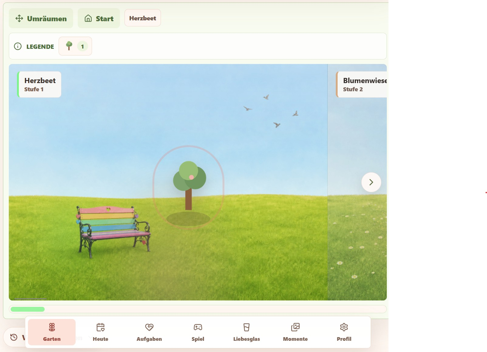

# Herzgarten

Herzgarten ist eine spielerische Paar-App, die eine Beziehung stärken und vertiefen soll. Gemeinsam können zwei Partner einen virtuellen Garten anlegen und diesen mit Fragen, Aufgaben und Liebesbriefen pflegen. Das Ziel ist es, spielerisch mehr über sich selbst und den Partner zu erfahren, die Kommunikation zu fördern und die Beziehung zu feiern.

Der Garten kann mit neuen Elementen gefüllt werden und neue Gartenbereiche freigespielt werden.



Kurzüberblick der wichtigsten Funktionen:
- __tägliche Fragen__, die zum Nachdenken und Austausch anregen und von beiden Partnern beantwortet werden müssen, damit sie im Garten blühen
- __Aufgaben__, die gemeinsam erledigt werden können
- __Liebes-Zettel-Box__, um sich gegenseitig kleine Liebesbriefe zu hinterlassen
- __Erinnerungen__ an wichtige Termine oder gemeinsame Aktivitäten
- __Quiz__, um sich gegenseitig besser kennenzulernen


##  Entwicklung

Für Entwickler sind detaillierte Anleitungen [hier](DEV.md) zusammengefasst.

## Schnellstart via Docker

Für das Production-Deployment liegt ein Beispiel-Compose in [release/docker-compose.prod.yml](release/docker-compose.prod.yml) bereit. 

Ändere die Datei [.env.example](release/.env.example) Datei in `.env` und ergänze die nötigen Informationen.

Starten den Docker Stack:

```bash
docker compose -f release/docker-compose.prod.yml up -d
```

Beispiel `.env`:

```env
HERZGARTEN_TAG=0.1.0 # docker image version, siehe z.B. die Github Release Versionen
LOG_LEVEL=info # debug, info, warn, error oder silent


# Database (Postgres)
POSTGRES_DB=herzgarten
POSTGRES_USER=herzgarten
POSTGRES_PASSWORD=changeme

# JWT-Secrets / Admin (wichtig in production)
JWT_SECRET=your-strong-jwt-secret
ADMIN_JWT_SECRET=your-strong-admin-jwt-secret
ADMIN_PASSWORD=your-admin-password


# Optional: Browser Push (Web Push / VAPID)
PUSH_ENABLED=true
VAPID_PUBLIC_KEY=your_vapid_public_key
VAPID_PRIVATE_KEY=your_vapid_private_key
VAPID_SUBJECT=mailto:admin@your-domain.tld

# Optional: Basis Domain für den Passwort reset Fall z.B.
PUBLIC_BASE_URL=http://localhost:5173

# Optional: Email (SMTP) für Passwort reset Fall
EMAIL_ENABLED=false
EMAIL_SMTP_HOST=
EMAIL_SMTP_PORT=587
EMAIL_SMTP_SECURE=false
EMAIL_SMTP_USER=
EMAIL_SMTP_PASSWORD=
EMAIL_FROM_ADDRESS=
EMAIL_FROM_NAME=Herzgarten
EMAIL_REPLY_TO=

# Einstellungen für Passwort reset (nur relevant, wenn EMAIL_ENABLED=true)
PASSWORD_RESET_TTL_MINUTES=30
PASSWORD_RESET_LIMIT_PER_24H=3
```

Für das Erstellen von Browser Push Credentials (VAPID), siehe die [Entwickler Anleitungen](DEV.md).
